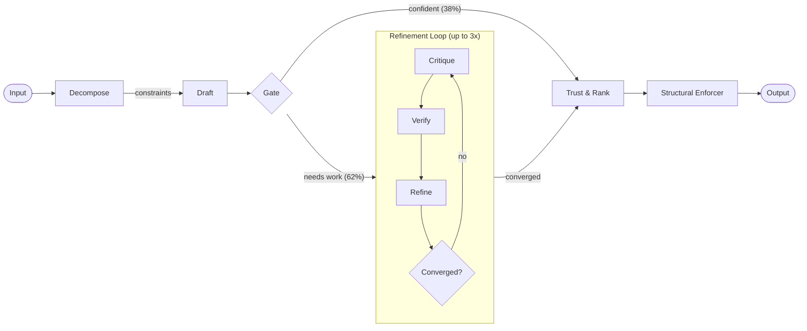
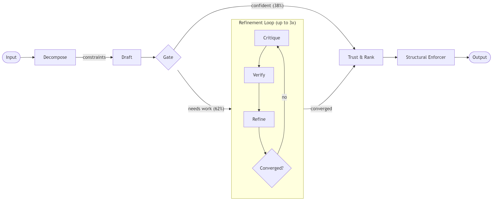
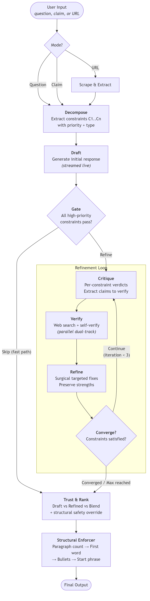
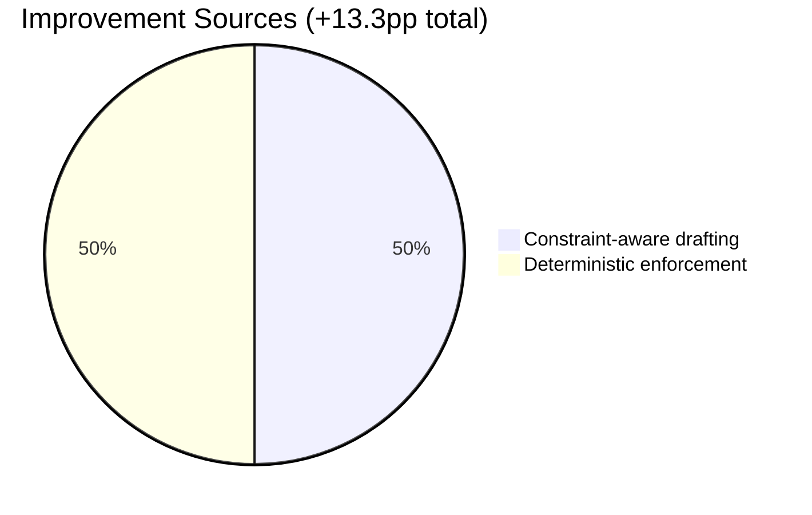
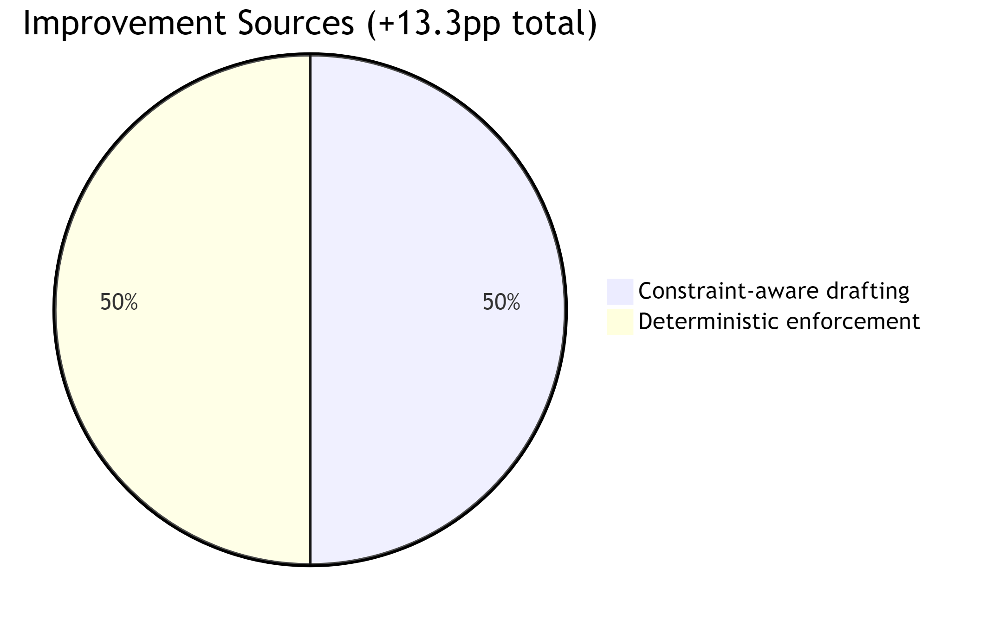

<p align="center">
  
</p>

<p align="center">
  <strong>A self-correcting AI pipeline that decomposes constraints, iteratively verifies against live sources, and deterministically enforces what LLMs can't.</strong>
</p>

<p align="center">
  <a href="https://thinktwice-ai.vercel.app"><strong>Try it live</strong></a>&nbsp;&nbsp;&bull;&nbsp;&nbsp;<a href="results/ifeval/ANALYSIS.md">Full evaluation</a>&nbsp;&nbsp;&bull;&nbsp;&nbsp;<a href="#quick-start">Quick start</a>
</p>

<p align="center">
  
</p>

---

## How It Works

ThinkTwice wraps any LLM call in an 8-phase self-correction loop. It decomposes requests into atomic constraints, drafts a response, gates easy prompts through a fast path, and iteratively critiques, verifies, and refines until constraints converge — then deterministically enforces structural requirements that LLMs fundamentally cannot self-enforce.



<details>
<summary><strong>Can't see the diagram? (GitHub mobile)</strong></summary>
<br>
<p align="center">
  
</p>
</details>

<details>
<summary><strong>What each phase does</strong></summary>

<br>

| Phase | What It Does | How |
|-------|-------------|-----|
| **Decompose** | Breaks input into atomic constraints with priority levels | LLM tool call extracts constraints with type, priority, and verifiability |
| **Draft** | Generates initial response with streaming | Standard LLM generation, streamed token-by-token |
| **Gate** | Decides if draft is good enough to skip refinement | Structural analysis + LLM sub-question evaluation per constraint |
| **Critique** | Evaluates draft against every constraint | Per-constraint verdicts + extracts claims to verify |
| **Verify** | Dual-track fact verification | Web search + self-verification in parallel |
| **Refine** | Surgical fixes based on critique + verification | Targeted changes only — preserves what works |
| **Convergence** | Lightweight re-check of constraint satisfaction | Exits loop when high-priority constraints pass |
| **Trust & Rank** | Picks best version: draft vs. refined vs. blend | Side-by-side comparison with structural safety override |
| **Structural Enforcer** | Deterministic post-processing for counting constraints | Pure string manipulation, no API calls |

</details>

<details>
<summary><strong>Detailed pipeline architecture</strong></summary>

<br>


<details>
<summary><strong>Can't see the diagram? (GitHub mobile)</strong></summary>
<br>
<p align="center">
  
</p>
</details>

</details>

---

## Quick Start

### Try it online

Visit **[thinktwice-ai.vercel.app](https://thinktwice-ai.vercel.app)** — paste your [Anthropic API key](https://console.anthropic.com/) and start asking questions. Your key stays in your browser and is never stored on the server.

### Run locally

```bash
git clone https://github.com/apattichis/thinktwice.git
cd thinktwice

cp .env.example .env
# Add your ANTHROPIC_API_KEY to .env

# Backend
cd backend && pip install -r requirements.txt && python main.py

# Frontend (new terminal)
cd frontend && npm install && npm run dev
```

Open [http://localhost:5173](http://localhost:5173)

```bash
# Or with Docker
docker-compose up --build
```

<details>
<summary><strong>Environment variables</strong></summary>

<br>

| Variable | Required | Default | Description |
|----------|:--------:|:-------:|-------------|
| `ANTHROPIC_API_KEY` | No | — | Anthropic API key (optional with BYOK) |
| `BRAVE_SEARCH_API_KEY` | No | — | Brave Search for web verification |
| `TAVILY_API_KEY` | No | — | Tavily API (fallback search) |
| `GATE_THRESHOLD` | No | `85` | Confidence threshold for fast-path (0-100) |
| `MAX_ITERATIONS` | No | `3` | Max refinement loop iterations |
| `CONVERGENCE_THRESHOLD` | No | `80` | Convergence confidence threshold |
| `SELF_VERIFY_PARALLEL` | No | `true` | Run web + self verification in parallel |
| `TRUST_BLEND_ENABLED` | No | `true` | Enable draft vs. refined blending |

</details>

---

## Tech Stack

| Layer | Technology |
|-------|------------|
| Frontend | Next.js 16, React 19, Tailwind CSS v4, Framer Motion |
| Backend | Python 3.11+, FastAPI, Pydantic v2, SSE-Starlette |
| AI | Anthropic Claude API (tool use for structured outputs) |
| Search | Brave Search API / Tavily API |
| Deployment | Vercel (frontend) + Render (backend) |

---

## Evaluation Results

Evaluated on **IFEval** (Instruction-Following Evaluation) — 120 stratified samples from 541, covering all 25 instruction types. Model: Claude 3.5 Haiku.

| Metric | Single-Shot | ThinkTwice | Delta |
|--------|:-----------:|:----------:|:-----:|
| **Prompt Strict Accuracy** | 71.7% | **85.0%** | **+13.3pp** |
| Instruction Strict Accuracy | 79.9% | 89.7% | +9.8pp |
| Prompt Loose Accuracy | 82.5% | 87.5% | +5.0pp |
| Instruction Loose Accuracy | 88.0% | 91.3% | +3.3pp |

**Statistically significant** at p = 0.0014 (McNemar's test). ThinkTwice recovers 19 prompts that single-shot fails, while losing only 3 — a 6.3:1 win-to-loss ratio.

<details>
<summary><strong>Where ThinkTwice wins</strong></summary>

<br>

The biggest gains are on **countable structural constraints** — exactly where LLMs are weakest:

| Instruction Type | Single-Shot | ThinkTwice | Gain |
|-----------------|:-----------:|:----------:|:----:|
| Paragraph counts | 0% | 80% | +80pp |
| Case compliance | 50% | 100% | +50pp |
| First-word placement | 58% | 100% | +42pp |
| Constrained response | 86% | 100% | +14pp |
| Bullet list counts | 75% | 88% | +13pp |

Half the improvement comes from constraint-aware drafting, half from deterministic enforcement.

</details>

<details>
<summary><strong>Full 25-type breakdown</strong></summary>

<br>

13 of 25 instruction types achieve **100% accuracy**:

`english_capital` · `english_lowercase` · `repeat_prompt` · `two_responses` · `postscript` · `constrained_response` · `multiple_sections` · `number_highlighted_sections` · `existence` · `frequency` · `response_language` · `nth_paragraph_first_word` · `no_comma`

Remaining types:

| Type | Accuracy | Notes |
|------|:--------:|-------|
| `json_format` | 90% | LLM occasionally produces wrong JSON structure |
| `end_checker` | 89% | Near-perfect end-of-response formatting |
| `number_bullet_lists` | 88% | Enforcer handles most; edge cases remain |
| `number_placeholders` | 86% | Placeholder counting is reliable |
| `quotation` | 86% | Quote wrapping mostly caught by trust override |
| `title` | 80% | Refiner sometimes strips `<<title>>` formatting |
| `number_paragraphs` | 80% | 3 edge cases with markdown/separator ambiguity |
| `capital_word_frequency` | 76% | Not deterministically enforceable |
| `forbidden_words` | 67% | Strict mode catches extra occurrences |
| `letter_frequency` | 67% | Refinement disturbs character distributions |
| `number_words` | 67% | Small sample (n=3) |
| `number_sentences` | 0% | Sentence boundary detection is inherently ambiguous |

</details>

<details>
<summary><strong>How it achieves this</strong></summary>

<br>



<details>
<summary><strong>Can't see the diagram? (GitHub mobile)</strong></summary>
<br>
<p align="center">
  
</p>
</details>

The **structural enforcer** fires on ~50% of all samples. The **gate** correctly fast-paths 38% of prompts (91.3% accuracy) while sending the harder 62% through refinement (81.1% accuracy) — both above the 71.7% baseline.

Full analysis: [`results/ifeval/ANALYSIS.md`](results/ifeval/ANALYSIS.md)

</details>

---

## API

| Method | Endpoint | Description |
|--------|----------|-------------|
| `POST` | `/api/think` | Pipeline execution (SSE stream) |
| `POST` | `/api/think/single-shot` | Single LLM call without pipeline |
| `POST` | `/api/validate-key` | Validate an Anthropic API key |
| `GET` | `/api/health` | Health check |

---

## License

[MIT](LICENSE)
