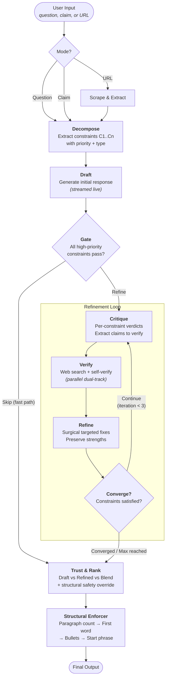
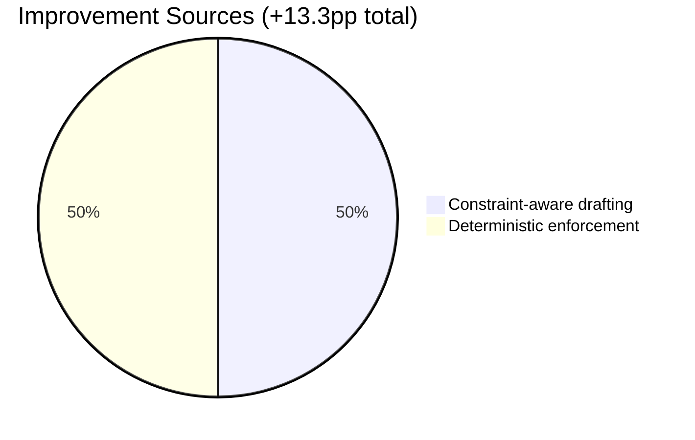

<p align="center">
  
</p>

<h1 align="center">ThinkTwice</h1>

<p align="center">
  <strong>A self-correcting AI pipeline that decomposes constraints, iteratively verifies against live sources, and deterministically enforces what LLMs can't.</strong>
</p>

<p align="center">
  <code>85.0% IFEval accuracy</code> &mdash; <code>+13.3pp over single-shot</code> &mdash; <code>p = 0.0014</code>
</p>

---

## How It Works

ThinkTwice wraps any LLM call in an 8-phase self-correction loop. Instead of hoping the model gets it right on the first try, it decomposes the request into atomic constraints, drafts a response, gates easy prompts through a fast path, and iteratively critiques, verifies, and refines until constraints converge — then deterministically enforces structural requirements that LLMs fundamentally cannot self-enforce (counting paragraphs, placing specific first words, formatting responses).


<details>
<summary><strong>Expand: What each phase does</strong></summary>

<br>

| Phase | What It Does | How |
|-------|-------------|-----|
| **Decompose** | Breaks input into atomic, verifiable constraints (C1, C2, ...) with priority levels | LLM tool call extracts constraints with type, priority, and verifiability |
| **Draft** | Generates initial response with streaming | Standard LLM generation, streamed token-by-token to frontend |
| **Gate** | Decides if draft is good enough to skip refinement | Programmatic structural analysis + LLM sub-question evaluation per constraint. Skips if confidence >= 85 and all high-priority constraints pass |
| **Critique** | Evaluates draft against every constraint | Per-constraint verdicts (satisfied / partially / violated) + extracts claims to verify |
| **Verify** | Dual-track fact verification | Web search + independent self-verification in parallel. Fuses verdicts with confidence-weighted agreement logic |
| **Refine** | Surgical fixes based on critique + verification | Targeted changes only — preserves what works, fixes what's violated, softens what's unclear |
| **Convergence** | Lightweight re-check of constraint satisfaction | Exits loop when high-priority constraints pass and confidence exceeds threshold |
| **Trust & Rank** | Picks best version: draft vs. refined vs. blend | Side-by-side LLM comparison with structural safety override (reverts to draft if refinement lost required structure) |
| **Structural Enforcer** | Deterministic post-processing for counting constraints | Fixes paragraph counts, first-word placement, bullet counts, constrained response format, start phrases — pure string manipulation, no API calls |

</details>

<details>
<summary><strong>Expand: Detailed pipeline architecture</strong></summary>

<br>



</details>

---

## Evaluation Results

Evaluated on **IFEval** (Instruction-Following Evaluation) — 120 stratified samples from 541, covering all 25 instruction types. Model: Claude 3.5 Haiku.

| Metric | Single-Shot | ThinkTwice | Delta |
|--------|:-----------:|:----------:|:-----:|
| **Prompt Strict Accuracy** | 71.7% | **85.0%** | **+13.3pp** |
| Instruction Strict Accuracy | 79.9% | 89.7% | +9.8pp |
| Prompt Loose Accuracy | 82.5% | 87.5% | +5.0pp |
| Instruction Loose Accuracy | 88.0% | 91.3% | +3.3pp |

**Statistically significant** at p = 0.0014 (McNemar's test). ThinkTwice recovers 19 prompts that single-shot fails, while losing only 3 — a **6.3:1 win-to-loss ratio**.

### Where ThinkTwice Wins

The biggest gains are on **countable structural constraints** — exactly the category where LLMs are weakest:

| Instruction Type | Single-Shot | ThinkTwice | Gain |
|-----------------|:-----------:|:----------:|:----:|
| Paragraph counts | 0% | 80% | **+80pp** |
| Case compliance | 50% | 100% | **+50pp** |
| First-word placement | 58% | 100% | **+42pp** |
| Constrained response | 86% | 100% | **+14pp** |
| Bullet list counts | 75% | 88% | **+13pp** |

Half the improvement comes from **constraint-aware drafting** (the decompose step makes the model aware of requirements it would otherwise ignore), and half from **deterministic enforcement** (fixing what LLMs fundamentally cannot do — counting).

<details>
<summary><strong>Expand: Full 25-type breakdown</strong></summary>

<br>

13 of 25 instruction types achieve **100% accuracy**:

`english_capital` · `english_lowercase` · `repeat_prompt` · `two_responses` · `postscript` · `constrained_response` · `multiple_sections` · `number_highlighted_sections` · `existence` · `frequency` · `response_language` · `nth_paragraph_first_word` · `no_comma`

Remaining types:

| Type | Accuracy | Notes |
|------|:--------:|-------|
| `json_format` | 90% | LLM occasionally produces wrong JSON structure |
| `end_checker` | 89% | Near-perfect end-of-response formatting |
| `number_bullet_lists` | 88% | Enforcer handles most; edge cases remain |
| `number_placeholders` | 86% | Placeholder counting is reliable |
| `quotation` | 86% | Quote wrapping mostly caught by trust override |
| `title` | 80% | Refiner sometimes strips `<<title>>` formatting |
| `number_paragraphs` | 80% | 3 edge cases with markdown/separator ambiguity |
| `capital_word_frequency` | 76% | Not deterministically enforceable |
| `forbidden_words` | 67% | Strict mode catches extra occurrences |
| `letter_frequency` | 67% | Refinement disturbs character distributions |
| `number_words` | 67% | Small sample (n=3) |
| `number_sentences` | 0% | Sentence boundary detection is inherently ambiguous |

</details>

### How It Achieves This



The **structural enforcer** fires on ~50% of all samples — meaning even with constraint-aware prompting, LLMs still can't count reliably half the time. The enforcer fixes paragraph counts, prepends missing first words, and formats constrained responses using pure string manipulation (no API calls, deterministic, cheap).

The **gate** correctly fast-paths 38% of prompts (91.3% accuracy on those) while sending the harder 62% through the full refinement loop (81.1% accuracy) — both well above the 71.7% single-shot baseline.

---

## Quick Start

### Prerequisites

- Python 3.11+
- Node.js 20+
- [Anthropic API key](https://console.anthropic.com/)

### Setup

```bash
git clone https://github.com/apattichis/thinktwice.git
cd thinktwice

cp .env.example .env
# Add your ANTHROPIC_API_KEY to .env

# Backend
cd backend && pip install -r requirements.txt && python main.py

# Frontend (new terminal)
cd frontend && npm install && npm run dev
```

Open [http://localhost:3000](http://localhost:3000)

```bash
# Or with Docker
docker-compose up --build
```

<details>
<summary><strong>Expand: Environment variables</strong></summary>

<br>

| Variable | Required | Default | Description |
|----------|:--------:|:-------:|-------------|
| `ANTHROPIC_API_KEY` | Yes | — | Anthropic API key |
| `BRAVE_SEARCH_API_KEY` | No | — | Brave Search for web verification |
| `TAVILY_API_KEY` | No | — | Tavily API (fallback search) |
| `GATE_THRESHOLD` | No | `85` | Confidence threshold for fast-path (0-100) |
| `MAX_ITERATIONS` | No | `3` | Max refinement loop iterations |
| `CONVERGENCE_THRESHOLD` | No | `80` | Convergence confidence threshold |
| `SELF_VERIFY_PARALLEL` | No | `true` | Run web + self verification in parallel |
| `TRUST_BLEND_ENABLED` | No | `true` | Enable draft vs. refined blending |

</details>

---

## Tech Stack

| Layer | Technology |
|-------|------------|
| Frontend | Next.js 16, React 19, Tailwind CSS v4, Framer Motion |
| Backend | Python 3.11+, FastAPI, Pydantic v2, SSE-Starlette |
| AI | Anthropic Claude API (tool use for structured outputs) |
| Search | Brave Search API / Tavily API |
| Eval | IFEval benchmark with 25 deterministic verifiers |

## API

| Method | Endpoint | Description |
|--------|----------|-------------|
| `POST` | `/api/think` | Pipeline execution (SSE stream) |
| `POST` | `/api/think/single-shot` | Single LLM call without pipeline |
| `GET` | `/api/health` | Health check |

<details>
<summary><strong>Expand: SSE event types</strong></summary>

<br>

The pipeline streams real-time events to the frontend:

| Event | When |
|-------|------|
| `step_start` / `step_complete` | Phase lifecycle |
| `step_stream` | Token-by-token draft streaming |
| `decompose_complete` | Constraints extracted |
| `gate_decision` | Skip or refine decision |
| `constraint_verdict` | Per-constraint critique result |
| `verify_claim` / `self_verify_claim` | Verification results |
| `iteration_start` / `iteration_complete` | Refinement loop tracking |
| `trust_decision` | Final winner selection |
| `pipeline_complete` | Done, with metrics |

</details>

---

## Evaluation

```bash
# Run ThinkTwice on IFEval (120 samples)
python eval/run_eval.py --dataset ifeval --pipeline thinktwice --samples 120

# Run single-shot baseline
python eval/run_eval.py --dataset ifeval --pipeline single_shot --samples 120

# Run both + statistical comparison
python eval/run_eval.py --dataset ifeval --pipeline all --samples 120
```

Full analysis with charts, per-type breakdowns, and discussion: [`results/ifeval/ANALYSIS.md`](results/ifeval/ANALYSIS.md)

---

## License

[MIT](LICENSE)
