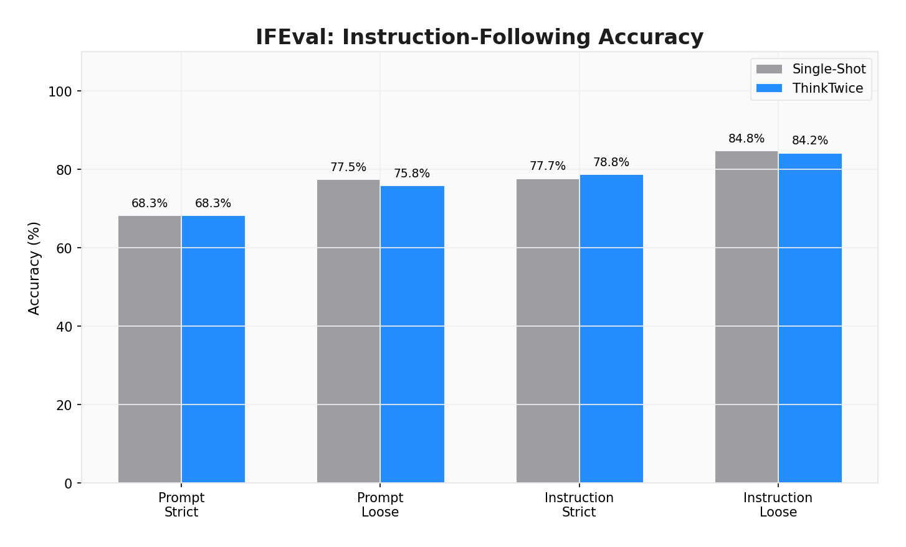
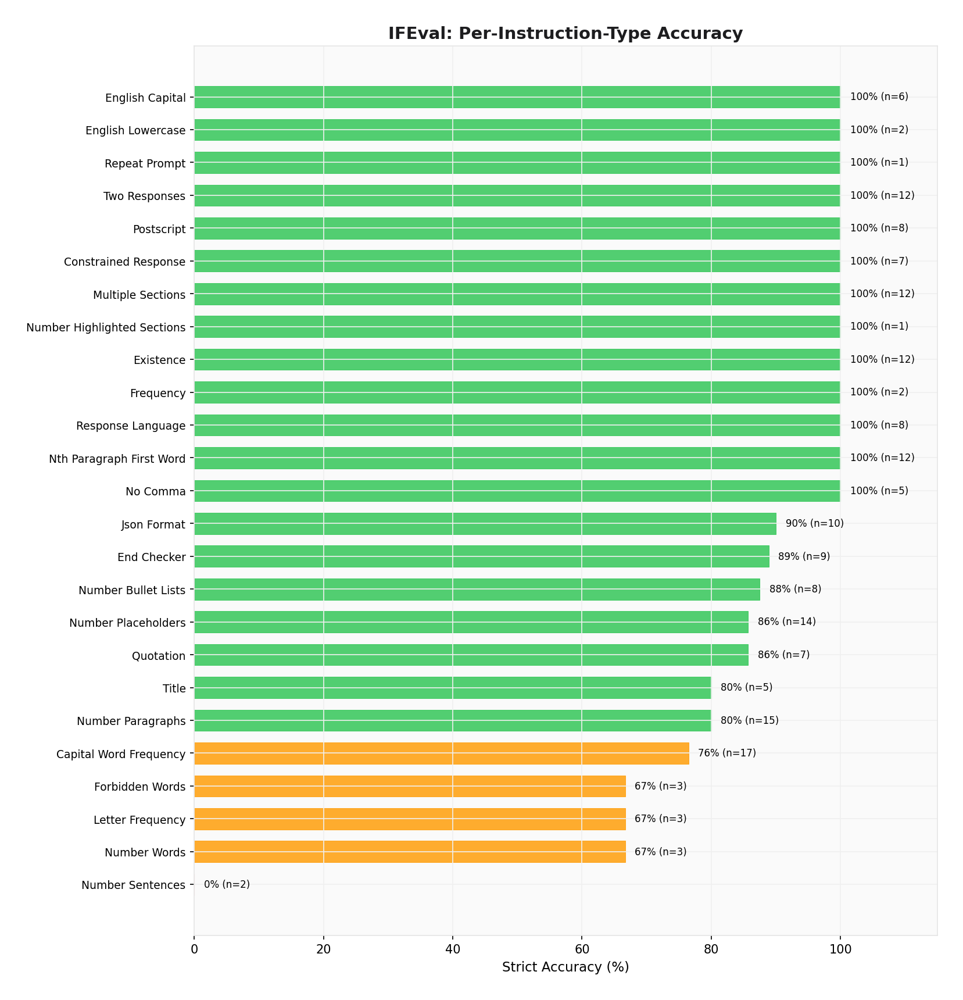
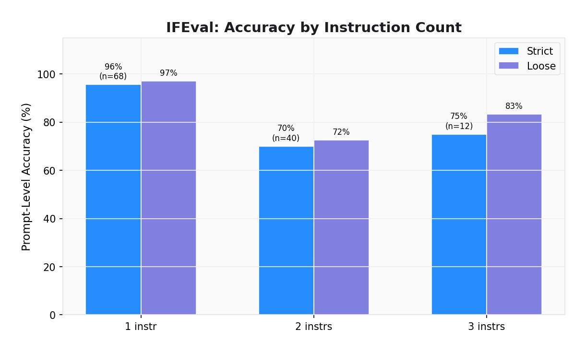

# IFEval: Instruction-Following Evaluation Report

**Dataset:** ifeval  
**Generated:** 2026-02-07 02:51:06  
**Total Prompts:** 120  
**Total Instructions:** 184  
**Pipeline:** ThinkTwice (self-correcting pipeline)  

## 1. Executive Summary

IFEval tests whether models can follow specific formatting, structural, and content instructions. This evaluates ThinkTwice's constraint decomposition and iterative refinement capabilities.

| Metric | Value |
|--------|-------|
| **Prompt-Level Strict Accuracy** | 68.3% (82/120) |
| **Instruction-Level Strict Accuracy** | 78.8% (145/184) |
| **Prompt-Level Loose Accuracy** | 75.8% (91/120) |
| **Instruction-Level Loose Accuracy** | 84.2% (155/184) |
| **Mean Latency** | 82.1s |
| **P95 Latency** | 211.5s |

## 2. Methodology

### IFEval Metrics (per the original paper)

- **Prompt-level strict**: Prompt passes only if ALL instructions pass exactly
- **Instruction-level strict**: Percentage of individual instructions that pass exactly
- **Prompt-level loose**: Same but with 8 response transformations (strip markdown, trim lines, remove bookends)
- **Instruction-level loose**: Same with transformations

All verification is **deterministic** (no LLM judge). Each instruction type has a specific verifier that checks word counts, formatting, keywords, case, etc.

## 3. Pipeline Comparison

| Metric | Single-Shot | ThinkTwice | Delta |
|--------|-------------|------------|-------|
| **Prompt Strict Acc** | 68.3% | 68.3% | +0.0% |
| **Instr Strict Acc** | 77.7% | 78.8% | +1.1% |
| **Prompt Loose Acc** | 77.5% | 75.8% | -1.7% |
| **Instr Loose Acc** | 84.8% | 84.2% | -0.5% |
| **Mean Latency** | 17.5s | 82.1s | +64.7s |

### Statistical Significance (McNemar's Test)

- **Significant:** No (p < 0.05)
- **Chi-squared:** 0.1000
- **p-value:** 0.751830
- **Paired samples:** 120
- **Both correct:** 77
- **SS only correct:** 5
- **TT only correct:** 5
- **Both wrong:** 33

## 4. Per-Instruction-Type Breakdown

| Instruction Type | Strict Acc | Loose Acc | Count |
|-----------------|-----------|----------|-------|
| English Capital | 100% | 100% | 6 |
| English Lowercase | 100% | 100% | 2 |
| Repeat Prompt | 100% | 100% | 1 |
| Two Responses | 100% | 100% | 12 |
| Postscript | 100% | 100% | 8 |
| Json Format | 100% | 100% | 10 |
| Multiple Sections | 100% | 100% | 12 |
| Number Highlighted Sections | 100% | 100% | 1 |
| Title | 100% | 100% | 5 |
| Frequency | 100% | 100% | 2 |
| Response Language | 100% | 100% | 8 |
| No Comma | 100% | 100% | 5 |
| Quotation | 100% | 100% | 7 |
| Existence | 92% | 92% | 12 |
| End Checker | 89% | 89% | 9 |
| Number Bullet Lists | 88% | 88% | 8 |
| Capital Word Frequency | 76% | 76% | 17 |
| Number Placeholders | 71% | 71% | 14 |
| Constrained Response | 71% | 71% | 7 |
| Forbidden Words | 67% | 100% | 3 |
| Letter Frequency | 67% | 67% | 3 |
| Number Words | 67% | 67% | 3 |
| Number Sentences | 50% | 50% | 2 |
| Number Paragraphs | 20% | 80% | 15 |
| Nth Paragraph First Word | 17% | 17% | 12 |

## 5. Accuracy by Instruction Count

| Instructions per Prompt | Strict Acc | Loose Acc | Count |
|------------------------|-----------|----------|-------|
| 1 | 72% | 79% | 68 |
| 2 | 68% | 72% | 40 |
| 3 | 50% | 67% | 12 |

## 6. Pipeline Analysis

### Gate Mechanism
- Total runs: 120
- Fast-path: 41 (34.2%)
- Average iterations: 1.0

### Constraint Satisfaction
- Total constraints: 685
- Satisfied: 227 (33.1%)

## 7. Latency Analysis

| Statistic | Value |
|-----------|-------|
| Mean | 82.1s |
| Median | 77.1s |
| P95 | 211.5s |
| Min | 14.2s |
| Max | 267.8s |

## 8. Discussion

ThinkTwice achieves **68.3%** prompt-level strict accuracy, comparable to single-shot (68.3%). The pipeline's additional processing does not significantly improve instruction following on this benchmark, suggesting the base model already handles these constraints well.
